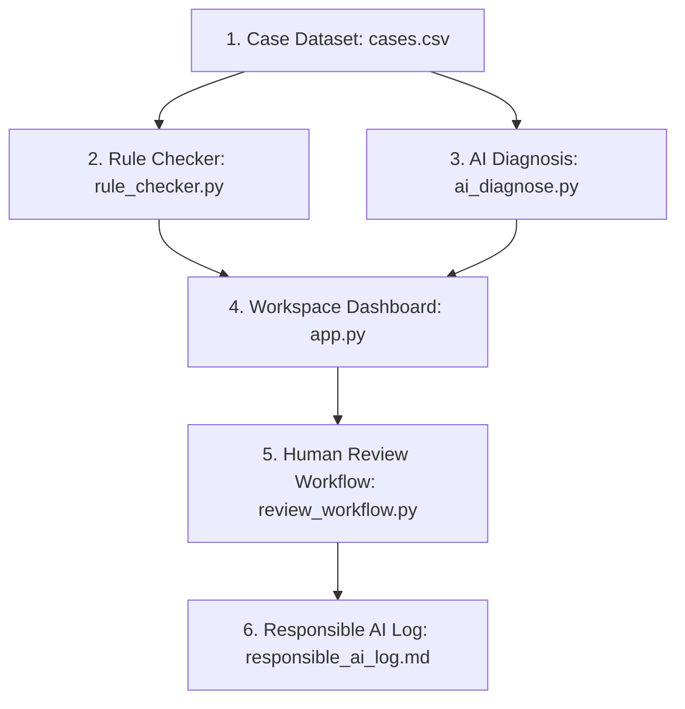

# Project Documentation — NetSage AI

NetSage AI is an AI-assisted troubleshooting assistant for Cisco Packet Tracer network configurations. It integrates a deterministic local rules engine with LLM diagnostics under a strict human-in-the-loop safety audit workflow.

---

## 1. Problem Statement
Junior network engineers often struggle to diagnose the root causes of network failures because symptoms (e.g., lack of ping or DNS failure) can arise from multiple layers (e.g., VLAN misconfigurations, ACL blocks, missing routing paths, or NAT issues). While they know individual commands, connecting a symptom to its exact configuration line is a significant skill gap.

NetSage AI bridges this gap by:
1. Running instant, deterministic rule checks locally for common structural errors.
2. Generating a deep LLM diagnosis from symptom details and cisco show-command outputs.
3. Enforcing a strict safety standard: **No AI diagnosis is ever auto-applied; a human network engineer must inspect, edit, and approve or reject every single fix.**

---

## 2. System Architecture
NetSage AI processes troubleshooting scenarios through a 6-stage engineering pipeline:



### Pipeline Script-to-Output Mapping
| Stage | Component | Script/Module | Input Files | Output Files | Description |
|---|---|---|---|---|---|
| 1 | Case Dataset | `src/generate_cases.py` | Built-in Definitions | `data/cases.csv` | Compilation of 32 Packet Tracer cases |
| 2 | Prompt Library | `prompts/` | None | `diagnose_prompt.md` | System prompts and worked examples |
| 3 | Rule Checker | `src/rule_checker.py` | `data/sample_network_state.json` | Console Findings / UI Table | Deterministic configuration checks |
| 4 | AI Diagnosis | `src/ai_diagnose.py` | `data/cases.csv`, System Prompts | `data/ai_diagnoses.json` | API/Offline fallback diagnosis runner |
| 5 | Human Review | `src/review_workflow.py` | `data/ai_diagnoses.json` | `data/human_review.csv` | Acceptance/Rejection/Edition logger |
| 6 | Responsible AI | `logs/responsible_ai_log.md` | `data/human_review.csv` | `logs/responsible_ai_log.md` | Log of corrected AI hallucinations |

---

## 3. Case Dataset
The dataset consists of 32 realistic Packet Tracer lab troubleshooting scenarios, evenly distributed across 8 categories (4 cases per category).

### Dataset Schema
- `case_id`: (String) Unique identifier (e.g., `VLAN-001`).
- `category`: (String) Domain (VLAN, Gateway, DHCP, DNS, Routing, ACL, NAT, Wireless).
- `symptom`: (String) Clear end-user symptom description.
- `topology_note`: (String) Layer 1 / Layer 2 physical path information.
- `show_output`: (String) Structured Cisco IOS command-line outputs (e.g., `show interfaces trunk`, `show standby brief`, `show run`).
- `expected_fault`: (String) The ground-truth configuration mistake.
- `osi_layer`: (String) OSI Layer classification (Layer 1 to Layer 7).
- `concept_tag`: (String) Categorical tag for grouping checks.
- `severity`: (String) Impact level (Critical, High, Medium, Low).

### Category Distribution Table
| Category | Cases Count | OSI Layer Target | Sub-concepts Covered |
|---|---|---|---|
| **VLAN** | 4 | Layer 2 | Native mismatch, allowed lists, access ports, trunk encapsulation |
| **Gateway** | 4 | Layer 1 / 3 | HSRP group mismatch, subinterface shutdown, host gateway mismatch, Proxy ARP |
| **DHCP** | 4 | Layer 3 | Helper-address missing, pool exhaustion, subnet mask mismatch, IP conflicts |
| **DNS** | 4 | Layer 7 | Server IP configuration, lookup lookup status, host A-records, zones |
| **Routing** | 4 | Layer 3 | OSPF Area mismatch, static route missing, MTU mismatch, static loops |
| **ACL** | 4 | Layer 4 | Port filtering, VTY implicit deny, ACL directions, rule ordering |
| **NAT** | 4 | Layer 3 | Swapped interfaces, missing overload (PAT), ACL subnet range, static mapping |
| **Wireless** | 4 | Layer 1 / 2 | WPA2 PSK mismatch, SSID broadcast, AP port access vlan, SVI VLAN down |

### Examples from the Dataset
*   **VLAN-001**: Native VLAN mismatch on the trunk link between Sw1 (VLAN 10) and Sw2 (VLAN 99). Gi0/1 shows mismatched native IDs in `show interfaces trunk`.
*   **GW-001**: HSRP Group ID mismatch. R1 standby brief shows `Grp 1` and R2 shows `Grp 2`, causing both to claim Active status.
*   **RT-001**: OSPF Area mismatch. R1 Gi0/1 shows `Area 0`, while R2 Gi0/1 shows `Area 10`, preventing adjacency.

---

## 4. Prompt Library
The system uses `prompts/diagnose_prompt.md` to run the analysis. It is designed to force Claude 3.5 Sonnet to output a strictly formatted JSON block with these fields:

| Field Name | Data Type | Purpose / Description |
|---|---|---|
| `root_cause` | String | Technical description of the exact configuration mistake |
| `osi_layer` | String | OSI Layer mapping (Layer 1 - Layer 7) |
| `confidence` | String | High / Medium / Low assessment of diagnosis |
| `evidence` | String | Exact quote or parameter mismatch from the show outputs |
| `next_command` | String | Verification Cisco IOS command to run |
| `fix_steps` | String | Multi-line Cisco CLI commands to apply as a solution |
| `security_issue` | Boolean | True if the configuration failure exposes a security vulnerability |
| `alternative_cause`| String | An alternative explanation to prevent model tunnel-vision |

### Worked Few-Shot Examples
The prompt includes 3 worked examples (OSPF Hello timer mismatch, Native VLAN mismatch, and ACL web traffic block). These teach the model:
1. The exact syntax mapping for the JSON.
2. The requirement to quote evidence directly instead of summarizing.
3. The format of step-by-step CLI commands (e.g. `configure terminal`, specific interface, the command, `end`).

---

## 5. Deterministic Rule Checker
The rule checker runs independent of the AI, verifying configuration structure from `data/sample_network_state.json`.

### Supported Rules
1. **duplicate_ip**: Checks if the same IP is assigned to multiple devices.
2. **wrong_mask**: Checks for overlapping subnet networks with mismatched mask lengths (e.g., `/24` vs `/25`).
3. **gateway_mismatch**: Verifies that a host's default gateway lies inside its local subnet range, and that the gateway IP corresponds to an active device interface in the topology.
4. **interface_down**: Checks if physical or logical subinterfaces have a state of "down" or "administratively down".
5. **missing_vlan**: Flags switchports assigned to access VLANs that are completely missing from the switch's VLAN database.
6. **missing_route**: Flags routers that are missing expected routing configurations to specified target networks.

### Pytest Coverage Summary
We created 12 unit tests in `tests/test_rule_checker.py` (one positive test and one negative test for each of the 6 rules). All 12 tests pass successfully, confirming rule logic operates with zero network access.

---

## 6. AI Diagnosis Workflow
- **Live Mode**: Reads cases from `data/cases.csv` and calls `claude-3-5-sonnet-20241022` using the `anthropic` SDK. It feeds the case's symptom and show outputs, parses the JSON string response, and writes it to `data/ai_diagnoses.json`.
- **Offline Fallback Mode**: If `ANTHROPIC_API_KEY` is not found, the script uses the `--offline` flag. It reads the expected fault from the CSV file and populates the JSON schema fields using preset templates. It marks the result with `"_offline_stub": true` to ensure complete honesty.

---

## 7. Human Review & Responsible AI
The human review workflow is managed via `src/review_workflow.py` and persisted in `data/human_review.csv`. 

### Seeded Mistakes & Correction Analysis
To establish a substantive Responsible AI dataset, 6 cases in `data/ai_diagnoses.json` were pre-loaded with common AI failures (hallucinated timer intervals, over-specifying local DHCP pools instead of IP helpers, recommending total security ACL removals, etc.). 
The human review file (`data/human_review.csv`) is pre-populated with "Edited" statuses correcting these mistakes. The initial dashboard agreement rate is **0%** for reviewed cases, showing that human auditing successfully caught and resolved all 6 model issues.

---

## 8. Dashboard
The Streamlit app (`app.py`) provides a premium, responsive multi-tab interface:
- **Dashboard Overview**: Key metrics (Total, Audited, Pending, Agreement Rate) with Plotly bar/pie charts representing category, severity, and status distributions.
- **Case Browser**: A searchable, filterable dataframe of all 32 cases with their current audit statuses.
- **Troubleshooting Workspace**: Displays symptom details and CLI outputs side-by-side with AI diagnosis fields, presenting an interactive audit form to Accept, Edit, or Reject the diagnosis.
- **Rule Checker Sandbox**: Allows pasting or uploading topology JSON config to instantly see deterministic findings.
- **Responsible AI Log**: Renders `logs/responsible_ai_log.md` directly.

---

## 9. Deployment
The application is ready to be deployed to **Streamlit Community Cloud** or **Render.com**.

### Steps for Streamlit Community Cloud:
1. Commit all files to a public GitHub repository.
2. Log into [share.streamlit.io](https://share.streamlit.io).
3. Connect the repository, set the branch to `main`, and the file entry point to `app.py`.
4. In the app Settings under "Secrets", add the optional Anthropic API key:
   ```toml
   ANTHROPIC_API_KEY = "your-actual-api-key"
   ```
5. Deploy. If the API key is not supplied, the application will default to offline demo mode using the pre-generated `data/ai_diagnoses.json`.

---

## 10. How to Run Locally
Ensure Python 3.11+ is installed.

```bash
# Clone the repository
git clone <repository_url> netsage-ai
cd netsage-ai

# Install dependencies
python -m pip install -r requirements.txt

# Run pytest unit tests
python -m pytest tests/

# Start the Streamlit application
python -m streamlit run app.py
```

---

## 11. Limitations & Future Work
- **Mock Cisco Inputs**: The data is synthetic Cisco IOS CLI show commands. Real Cisco Packet Tracer API or console integrations would allow live fetching of configuration states.
- **Rule Coverage**: Expanding the rule checker to inspect OSPF timers, ACL syntax, and HSRP authentication details deterministically.
- **State Capture**: Capturing complete host state (e.g. routing tables, ARP caches) to run cross-layer checks automatically.

---

## 12. Conclusion
NetSage AI demonstrates how deterministic rules and LLM reasoning can be combined under a strict safety audit framework to safely train junior engineers and troubleshoot complex environments without introducing configuration security risks.
